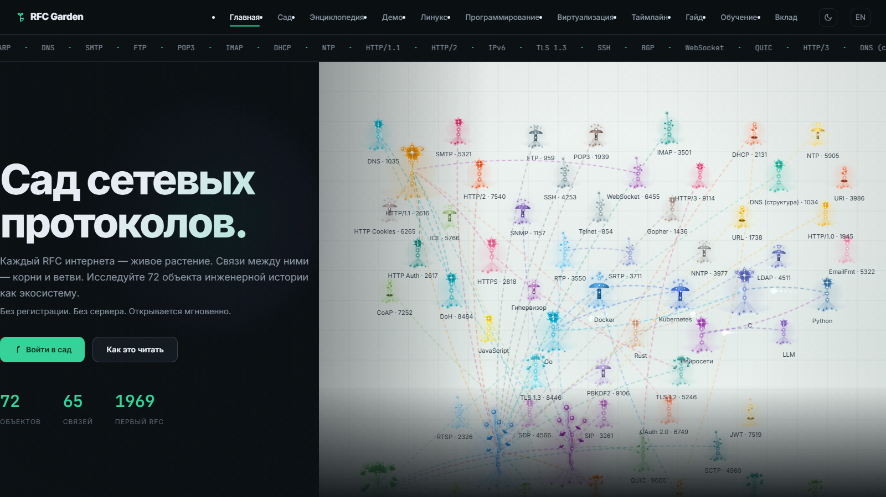
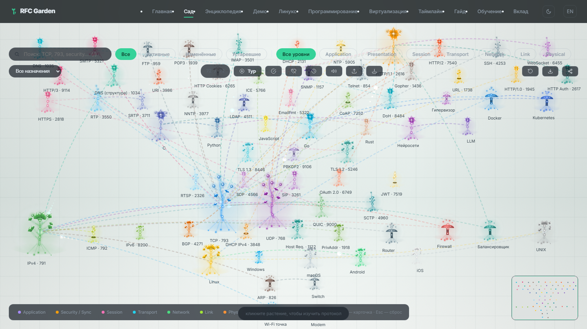
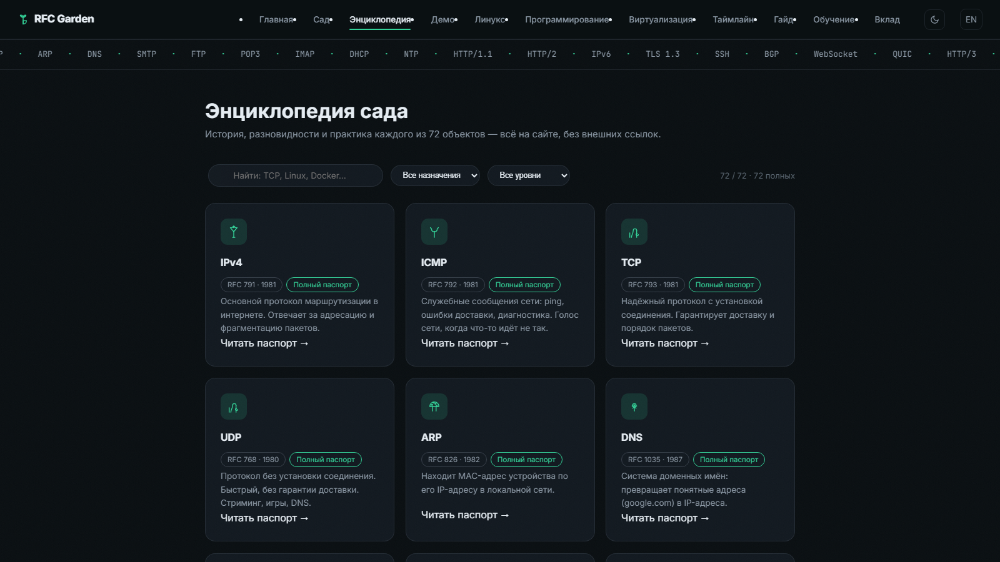

# RFC Garden — Сад сетевых протоколов / Interactive Network Protocol Garden

**Интерактивный сад сетевых протоколов. Увидь сеть как живую экосистему.**
**An interactive garden of network protocols. See the network as a living ecosystem.**

[](LICENSE)
[](js/)
[](tests/run-all.js)
[](https://nodejs.org/)
[](https://kidjinbruh-del.github.io/rfc-garden/)

[Русский](#russian) · [English](#english)



**Живой сайт / Live demo: https://kidjinbruh-del.github.io/rfc-garden/**

---

<a id="russian"></a>
## Русский

### Возможности
- **Живой сад**: 72 объекта (протоколы, железо, ОС, виртуализация, языки, ИИ) как процедурные техно-растения: L-системы + Perlin-шум, оптоволоконные стебли, кристаллы, стеклянные плоды.
- **Граф зависимостей**: дуги «построено на», бегущие частицы-пакетики, подсветка путей, сравнение двух узлов.
- **Производительность**: спрайт-кэш тел растений, culling за кадром, LOD, тиры качества (low/med/high) + FPS auto-tuning, `?perf=` оверрайд.
- **Обучение**: квиз (режимы «Угадай» и «Диагноз»), режим экзамена, авто-тур, глоссарий, шпаргалка для печати, статистика, лабораторные преподавателю, тропы-гайды.
- **Прогресс**: гербарий достижений (8 ачивок, localStorage), виджет «Изучено N из 72», избранное, недавние, deep-link `#rfc0793`.
- **Motion-система**: появление блоков по скроллу (8 вариантов страниц), бегущая строка 72 имён, glow-курсор, магнитные кнопки, 3D-tilt, зерно, ripple кликов, ворота от FOUT.
- **Энциклопедия**: полные паспорта всех объектов (история, разновидности, практика) + отдельные статьи.
- **Справочники**: Linux (100+ карточек), программирование, виртуализация — с поиском и TOC.
- **NetPulse-демо**: живые наблюдения сети поверх стендов labspin.
- **RU/EN**: переключатель языка на каждой странице; тёмная/светлая тема.
- **Ноль инфраструктуры**: статика, открывается через `file://`, без сборки и зависимостей.
- **Доступность**: skip-links, ARIA, `prefers-reduced-motion`, клавиатурная навигация.
- **Тесты**: 11 сюит на чистом Node.js, CI на каждый push.

### Скриншоты
| Сад | Энциклопедия |
|---|---|
|  |  |

### Технологии
HTML5, CSS3 (variables, keyframes), JavaScript ES2017+ (без модулей, без сборки), Canvas 2D, JSON-данные, `localStorage`, Web Speech не используется. Тесты: Node.js ≥ 24, без зависимостей.

### Установка и запуск
```bash
git clone https://github.com/kidjinbruh-del/rfc-garden.git
cd rfc-garden
# Вариант 1: просто откройте index.html в браузере (всё работает через file://)
# Вариант 2: локальный сервер
python -m http.server 8080
# → http://127.0.0.1:8080/index.html
```

### Тесты
```bash
node tests/run-all.js
```
11 сюит: ids, data, guide, i18n, layout, encyclopedia, explore-runtime, main+timeline, intro, achievements, perf-smoke (≥30 FPS).

### Структура проекта
```
rfc-garden/
├── index.html            — главная: hero-сад, ярусы, студентам
├── explore.html          — интерактивный сад (поиск, фильтры, тур, экзамен)
├── encyclopedia.html     — энциклопедия + article.html (паспорта объектов)
├── glossary.html         — глоссарий терминов
├── timeline.html         — таймлайн 1958–2022
├── quiz.html             — квиз («Угадай», «Диагноз»)
├── stats.html            — статистика + прогресс изучения
├── cheatsheet.html       — шпаргалка для печати
├── teacher.html          — лабораторные
├── guide.html learn.html contribute.html — гайды
├── demo.html             — NetPulse-демо (+ netpulse_evidence.json)
├── linux.html programming.html virt.html — справочники
├── flora-lab.html        — стенд дизайна растений
├── PROTOCOLS.json        — экспорт данных (синхронизирован с js/data.js)
├── manifest.webmanifest  — PWA-манифест
├── css/
│   └── style.css         — дизайн-система + motion-система + адаптив
├── js/
│   ├── i18n.js           — RU/EN словарь (подключается первым)
│   ├── data.js           — 72 объекта, source of truth
│   ├── profiles.js       — полные паспорта энциклопедии
│   ├── garden.js         — движок сада (спрайты, culling, LOD)
│   ├── explore.js        — логика сада
│   ├── main.js           — главная (entrance, магнит, tilt, count-up)
│   ├── motion.js         — motion остальных страниц + полоса
│   ├── achievements.js   — достижения (observer, без правок explore.js)
│   ├── progress.js       — виджет «Изучено N из 72»
│   ├── handbook.js       — механика справочников
│   ├── icons.js          — 70 SVG-иконок
│   ├── intro.js          — кинематографичное интро (файл тестов)
│   └── theme.js          — тема
├── tests/                — 11 сюит, только Node.js (см. выше)
├── docs/                 — документация + скриншоты
├── .github/workflows/    — ci.yml (тесты), deploy.yml (Pages)
├── IDEAS.md              — банк идей развития
├── RFC_GARDEN_SPEC.txt   — исходная спецификация
├── CHANGELOG.md          — история изменений (Keep a Changelog)
├── CONTRIBUTING.md       — как контрибьютить
└── LICENSE               — MIT
```

### Документация
- [docs/](docs/) — индекс, архитектура, данные, визуал, контент, roadmap, FAQ.

### Лицензия
MIT — Трофимов Петр, 2026. См. [LICENSE](LICENSE).

### Контакты
- GitHub: https://github.com/kidjinbruh-del/rfc-garden (issues и PR — основной канал)
- Автор: Трофимов Петр

### Благодарности
- IETF и RFC Editor — открытые документы, на которых построен весь контент сада.
- Сообщество open-source — за инструменты, на которых всё держится.

---

<a id="english"></a>
## English

### Features
- **Living garden**: 72 objects (protocols, hardware, OS, virtualization, languages, AI) as procedural techno-plants: L-systems + Perlin noise, fiber-optic stems, crystals, glass fruits.
- **Dependency graph**: "built on" arcs, travelling packet particles, path highlighting, two-node compare.
- **Performance**: sprite cache for plant bodies, offscreen culling, LOD, quality tiers (low/med/high) + FPS auto-tuning, `?perf=` override.
- **Learning**: quiz ("Guess" and "Diagnose" modes), exam mode, auto-tour, glossary, printable cheatsheet, stats, teacher labs, guides.
- **Progress**: achievement herbarium (8 achievements, localStorage), "Studied N of 72" widget, favorites, recent, deep-link `#rfc0793`.
- **Motion system**: scroll reveals (8 page variants), 72-name ticker, glow cursor, magnetic buttons, 3D tilt, film grain, click ripples, FOUT gate.
- **Encyclopedia**: full profiles of every object (history, varieties, practice) + articles.
- **Handbooks**: Linux (100+ cards), programming, virtualization — with search and TOC.
- **NetPulse demo**: live network observations over labspin stands.
- **RU/EN**: language toggle on every page; dark/light theme.
- **Zero infrastructure**: static files, opens via `file://`, no build, no dependencies.
- **Accessibility**: skip links, ARIA, `prefers-reduced-motion`, keyboard navigation.
- **Tests**: 11 suites on plain Node.js, CI on every push.

### Screenshots
See table above (same images).

### Stack
HTML5, CSS3 (variables, keyframes), JavaScript ES2017+ (no modules, no build), Canvas 2D, JSON data, `localStorage`. Tests: Node.js ≥ 24, zero dependencies.

### Install & run
```bash
git clone https://github.com/kidjinbruh-del/rfc-garden.git
cd rfc-garden
# Option 1: just open index.html (works via file://)
# Option 2: local server
python -m http.server 8080
# → http://127.0.0.1:8080/index.html
```

### Tests
```bash
node tests/run-all.js
```
11 suites: ids, data, guide, i18n, layout, encyclopedia, explore-runtime, main+timeline, intro, achievements, perf-smoke (≥30 FPS).

### Project structure
Same tree as above (file names are self-explanatory; see Russian section for per-file notes).

### Docs
- [docs/](docs/) — index, architecture, data, visual, content, roadmap, FAQ.

### License
MIT — Petr Trofimov, 2026. See [LICENSE](LICENSE).

### Contacts
- GitHub: https://github.com/kidjinbruh-del/rfc-garden (issues and PRs)

### Acknowledgements
- IETF and RFC Editor — open documents behind all garden content.
